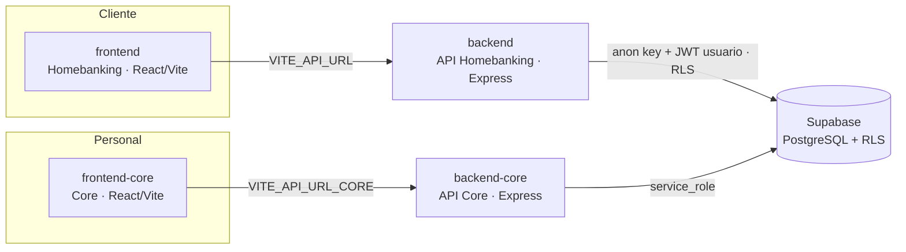

# Sistema Core Bancario + Homebanking — CMAC Piura

Plataforma bancaria educativa que integra un **Core Bancario** (operación del personal) con un
**Homebanking** (cara al cliente) sobre una **misma base de datos** Supabase (PostgreSQL).
Implementa el ciclo completo del crédito: el cliente solicita desde el Homebanking, el personal
evalúa/aprueba/desembolsa desde el Core, y el cliente ve el desembolso reflejado en su banca.

Incluye simulador de crédito (amortización francesa), reglas de negocio (elegibilidad, RDS,
scoring, ruta de aprobación por montos), RBAC por rol con contraseñas hasheadas, módulo de
recuperaciones/mora y un dashboard ejecutivo de cartera.

## Arquitectura

Cuatro piezas desplegables por separado que comparten la base de datos:



- **`frontend`** — Homebanking del cliente (login, simulador, solicitar crédito, mis
  solicitudes, dashboard de cuentas/movimientos).
- **`frontend-core`** — panel del personal (bandeja de solicitudes, flujo de otorgamiento,
  recuperaciones/mora, dashboard ejecutivo).
- **`backend`** — API del Homebanking. Usa la **anon key** + el token del usuario, de modo que
  **Row Level Security (RLS)** filtra los datos por cliente.
- **`backend-core`** — API del Core. Usa la **service_role** (el personal no es usuario de
  Supabase Auth) y valida el acceso con **RBAC por rol** en el backend.

## Stack

| Capa | Tecnología |
|---|---|
| Frontend | React 18 + Vite 5, React Router, Recharts, Axios |
| Backend | Node.js + Express 5 |
| Base de datos / Auth | Supabase (PostgreSQL, RLS, Auth) |
| Seguridad | bcrypt (personal), JWT HS256 (Core), rate limiting, cabeceras HTTP |
| Despliegue | Vercel (frontends) · Render (backends) |

## Puesta en marcha (local)

Requisitos: Node.js 18+ y un proyecto Supabase con los scripts de `backend/db/` aplicados.

**1. Base de datos** — ejecuta en el SQL Editor de Supabase, en orden, los scripts de
[`backend/db/`](backend/db/) (`00`→`12`). Ver [backend/db/README.md](backend/db/README.md).

**2. Variables de entorno** — copia cada `.env.example` a `.env` y complétalo:

| Pieza | Variables |
|---|---|
| `backend/.env` | `SUPABASE_URL`, `SUPABASE_KEY` (anon), `PORT`, `FRONTEND_URL` |
| `backend-core/.env` | `SUPABASE_URL`, `SUPABASE_SERVICE_KEY`, `CORE_JWT_SECRET`, `PORT`, `FRONTEND_CORE_URL` |
| `frontend/.env` | `VITE_API_URL` |
| `frontend-core/.env` | `VITE_API_URL_CORE` |

**3. Arranque** — cuatro terminales (backends primero):

```bash
cd backend        && npm install && npm start     # :3000  API Homebanking
cd backend-core   && npm install && npm start     # :3001  API Core
cd frontend       && npm install && npm run dev    # :5173  Homebanking web
cd frontend-core  && npm install && npm run dev    # :5174  Core web
```

## Flujo de otorgamiento (Core ↔ Homebanking)

```
[Cliente/HB]  Solicita crédito                → cmac_solicitudes (En Evaluacion)
[Asesor/Core] Registra ingresos + evaluación  → cmac_evaluaciones (RDS, semáforo, scoring)
[Asesor/Core] Envía a comité                  → nivel de aprobación por monto (En Comite)
[Comité/Core] Resuelve (Aprobado/Rechazado)
[Comité/Core] Desembolsa (atómico)            → cuenta_credito + plan_pagos + operación
[Cliente/HB]  Ve el crédito y el desembolso reflejados
```

Estados: `En Evaluacion → En Comite → Aprobado / Rechazado → Desembolsado`.

## Matriz de roles (RBAC — validado en el backend)

| Acción | Roles permitidos |
|---|---|
| Bandeja / detalle / consultas (lectura) | cualquier personal |
| Registrar ingresos / evaluación / enviar a comité | `asesor` |
| Emitir opinión | `administrador`, `jefe_regional`, `riesgos`, `analista` |
| Resolver comité / desembolsar | `comite` |
| Derivar a judicial (mora ≥ 121 días) | `administrador` |
| Castigar crédito (mora > 180 días) | `comite` |

## Recuperaciones / Mora

Bandas por días de atraso: **Vigente** (0), **Preventiva** (1–7), **Temprana** (8–30),
**Tardía** (31–120), **Judicial** (≥121), **Castigado** (>180). Ratio de mora (NPL) ≈ 13 % de
la cartera semilla. Incluye gestión de cobranza con historial y transiciones atómicas.

## Base de datos

El esquema del Core vive como migraciones SQL versionadas e idempotentes en
[`backend/db/`](backend/db/) (tablas con prefijo `cmac_`, PK `uuid`, RLS habilitado). El
Homebanking usa `cmac_cuentas` y `cmac_movimientos`.

## Documentación

En [`docs/`](docs/):
- [`DASHBOARD.md`](docs/DASHBOARD.md) — guía del dashboard ejecutivo.
- [`DESPLIEGUE.md`](docs/DESPLIEGUE.md) — checklist de despliegue (Vercel + Render).
- [`CASOS_PRUEBA_HB_CORE.md`](docs/CASOS_PRUEBA_HB_CORE.md) — recorrido del flujo de otorgamiento.
- [`CASOS_PRUEBA_MORA.md`](docs/CASOS_PRUEBA_MORA.md) — recorrido del módulo de mora.
- [`REPORTE_CIBERSEGURIDAD_S14.md`](docs/REPORTE_CIBERSEGURIDAD_S14.md) — revisión de seguridad.

READMEs por pieza: [backend](backend/README.md) · [backend-core](backend-core/README.md) ·
[frontend](frontend/README.md) · [frontend-core](frontend-core/README.md).
